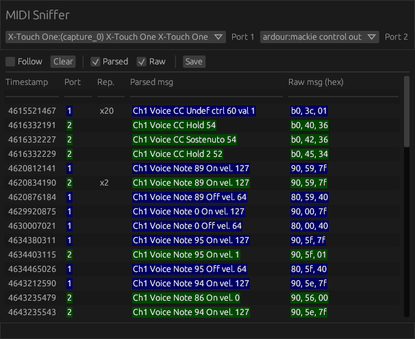

# midi-sniffer

`midi-sniffer` is portable GUI to inspect MIDI messages on up to 2 ports.



## Build

You need a stable Rust toolchain for the target host. Get it from [this page](https://www.rust-lang.org/fr/tools/install).
On a Unix-like system, you should be able to install `rustup` from your packet
manager.

Clone the git tree and run the following command in an environment where
`cargo` is available:

```
cargo b --release
```

This will compile the executable **without** `jack` support. If you need `jack`
support, use the following command:

```
cargo b --release --features=jack
```

**Note:** `jack` support requires development libraries and headers to be
available in your compilation environment. On a Unix-like system, the package
should be named `jack-audio-connection-kit-devel` or
`pipewire-jack-audio-connection-kit-devel`.

## Run

After a successful compilation, launch the executable with:

```
target/release/midi-sniffer
```

## LICENSE

This crate is licensed under MIT license ([LICENSE-MIT](LICENSE-MIT) or
http://opensource.org/licenses/MIT)
